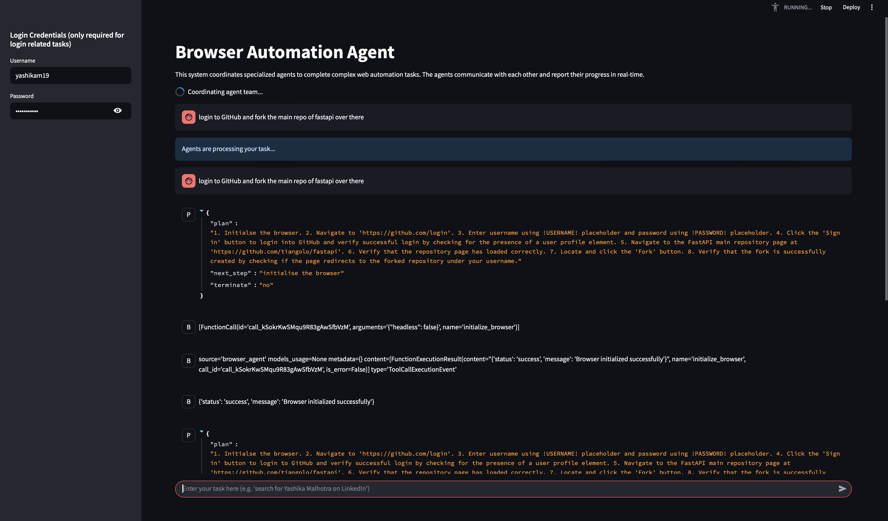
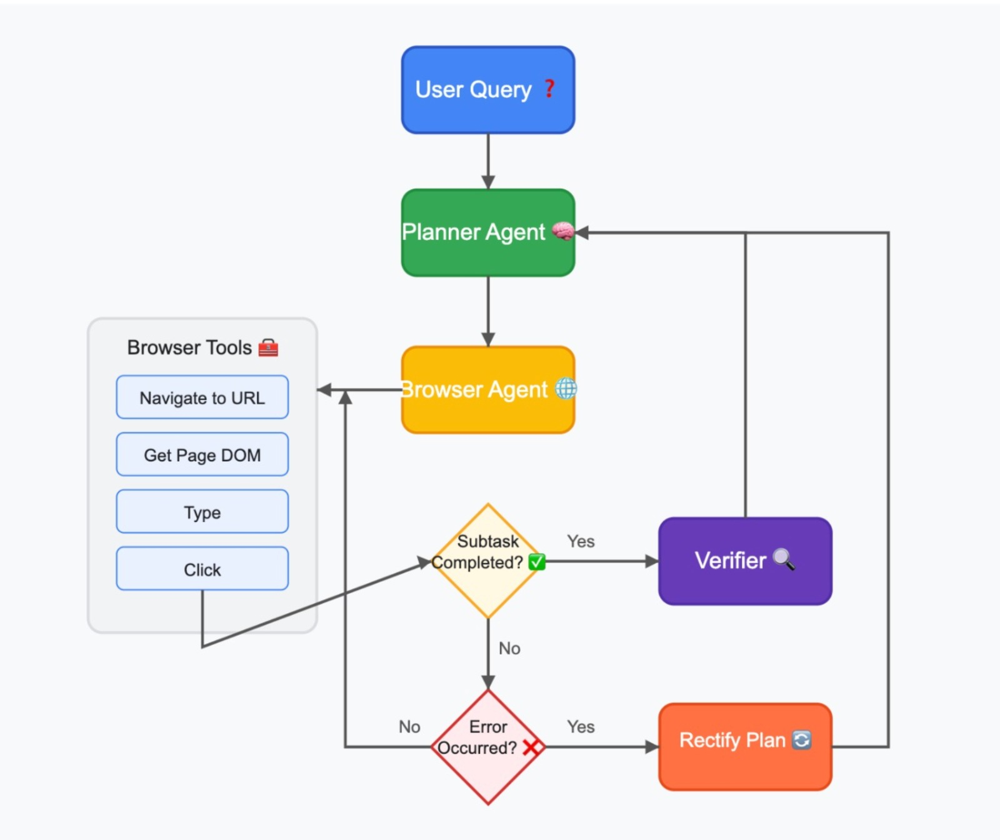

# BrowserPilot

A powerful web automation framework that performs complex browser tasks through natural language commands



## 🚀 Features

- **AI-Powered Web Automation**: Uses AI agents to interpret, plan and execute web interactions
- **Natural Language Control**: Describe tasks in plain English and let the framework handle the execution
- **Smart DOM Parsing**: Efficient DOM parsing with unique element identification
- **Secure Credential Handling**: Safe management of login credentials
- **Multi-Agent System**: Collaborative agents for planning and execution
- **Streamlit Interface**: User-friendly web interface for interaction
- **Error Recovery**: Adapts to errors and unexpected page states through verification and re-planning

## 🏗️ Architecture



The project consists of three main components:

1. **Playwright Manager** (`playwright_helper/`)
   - Handles browser automation actions
   - Manages DOM parsing and element interaction
   - Provides clean DOM representations

2. **Agent System** (`agents/`)
   - **Planner Agent**: Plans and breaks down tasks
   - **Browser Agent**: Executes web interactions
   - **User Proxy Agent**: Handles user verification and CAPTCHA solving

3. **Web Interface** (`app.py`)
   - Streamlit-based user interface
   - Task input and result visualization
   - Credential management

## 🛠️ Prerequisites

- Python 3.12+
- Node.js (for Playwright)
- OpenAI API key

## ⚙️ Installation

1. Install uv (if not already installed):
   ```bash
   # On macOS with Homebrew
   brew install uv

   # On macOS and Linux
   curl -LsSf https://astral.sh/uv/install.sh | sh
   
   # On Windows
   powershell -c "irm https://astral.sh/uv/install.ps1 | iex"
   ```

2. Clone the repository:
   ```bash
   git clone https://github.com/yashikam19/agentic-browser.git
   cd agentic-browser
   ```

3. Install dependencies and create virtual environment:
   ```bash
   # Install dependencies and create virtual environment
   uv sync
   
   # Activate virtual environment
   source .venv/bin/activate
   ```

4. Set up environment variables:
   Create a `.env` file in the root directory:
   ```bash
   OPENAI_API_KEY="your_openai_api_key"
   ```

5. Configure Streamlit secrets:
   Create `.streamlit/secrets.toml`:
   ```toml
   [credentials]
   username = "your_username"
   password = "your_password"
   ```

## 🚀 Usage

1. Start the application:
   ```bash
   streamlit run app.py
   ```

2. Access the web interface at `http://localhost:8501`

3. Enter your task in natural language and submit. Example tasks:
   ```bash
   "Login to Github and fork the main repo of FastAPI over there"
   "Login to amazon and track my latest order over there"
   "Search for Mansi Mishra on linkedin and send a 'Hi from agent' message"
   "Search for the oldest video of Mr. beast on youtube"
   ```

## Use Cases

- **Shopping Automation**: Find products, compare prices, add to cart
- **Travel Booking**: Search for flights/hotels with specific criteria
- **Research**: Collect information from multiple websites
- **Form Filling**: Complete registrations or applications
- **Content Extraction**: Get structured data from websites
- **Repetitive Tasks**: Automate any recurring browser-based workflow

## 🔒 Security

- Credentials are stored securely in Streamlit secrets
- API keys are managed through environment variables
- No sensitive data is logged or stored in plain text

## 🤝 Contributing

1. Fork the repository
2. Create a feature branch
3. Commit your changes
4. Push to the branch
5. Create a Pull Request

## 📄 License

This project is licensed under the MIT License - see the [LICENSE](LICENSE) file for details.
